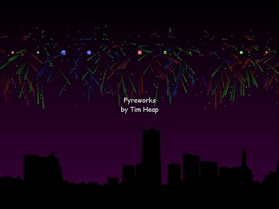



## Fyreworks

### Description

A really cool looking fireworks simulator. Lots of cool effects, looks good, render loop, uses a backbuffer, ,sound, you name it, its got it. look at the screenshot for an example. I dont care if you vote but please leave a comment!
 
### More Info
 

             |
---                |---
**Submitted On**   |2005-01-06 00:22:16
**By**             |[Tim Heap](https://github.com/Planet-Source-Code/PSCIndex/blob/master/ByAuthor/tim-heap.md)
**Level**          |Advanced
**User Rating**    |5.0 (25 globes from 5 users)
**Compatibility**  |VB 5\.0, VB 6\.0
**Category**       |[Graphics](https://github.com/Planet-Source-Code/PSCIndex/blob/master/ByCategory/graphics__1-46.md)
**World**          |[Visual Basic](https://github.com/Planet-Source-Code/PSCIndex/blob/master/ByWorld/visual-basic.md)
**Archive File**   |[Fyreworks183714162005\.zip](https://github.com/Planet-Source-Code/tim-heap-fyreworks__1-58131/archive/master.zip)

